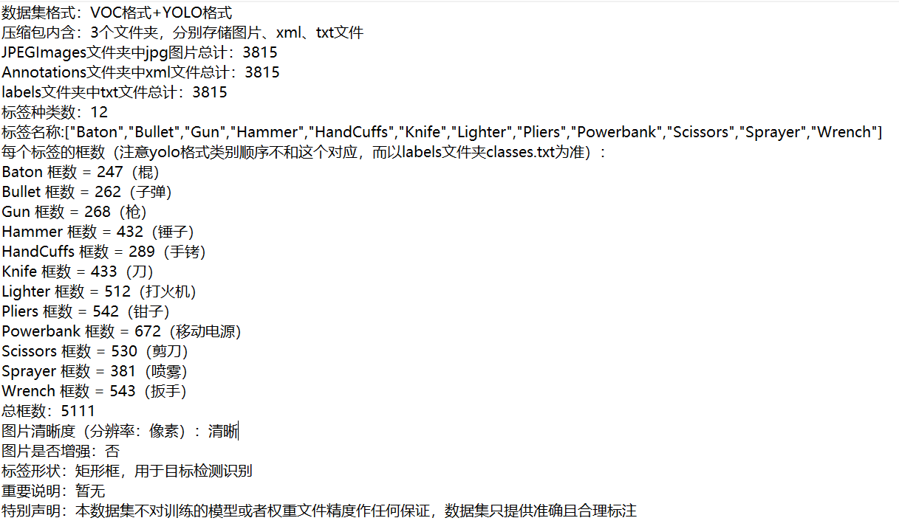
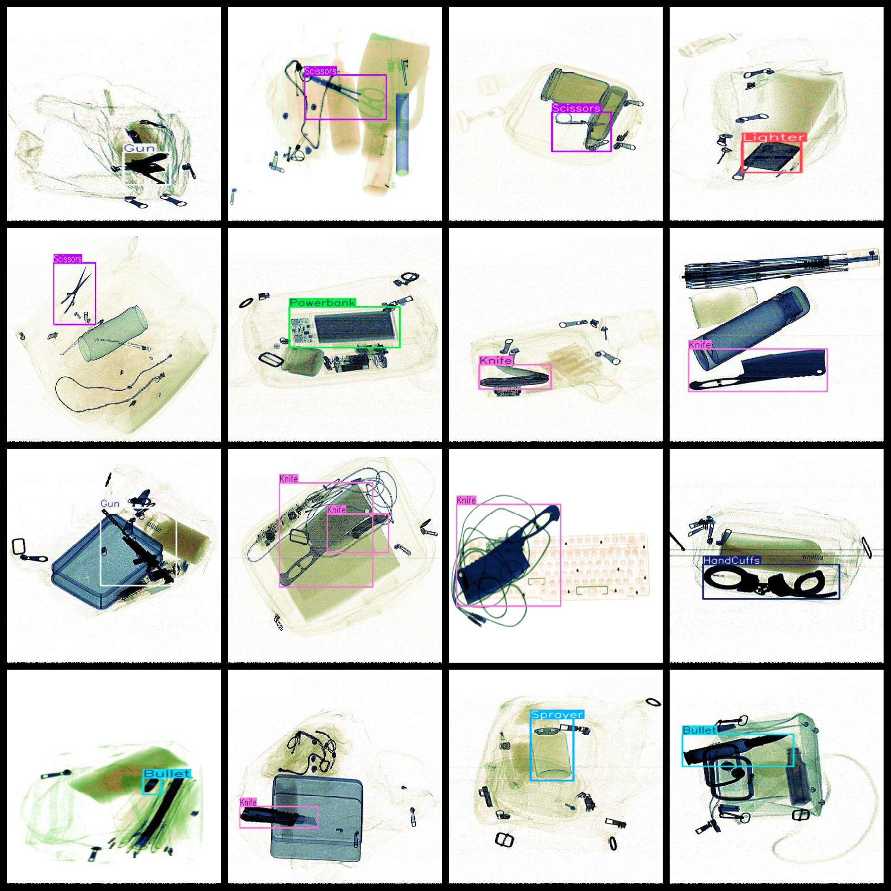

# [Object Detection] XLight Groove-Type Deformation Hazard re Dataset 3815 images12-classYOLO+VOC format

Annotation examples or image overview:

## Images

---

Here is a pay link on Stripe (https://buy.stripe.com/3cs8yP7sY87d0vu9AB). Please contact me lonlonago@foxmail.com after funding $89, and I will send you a complete data files, thank you!

